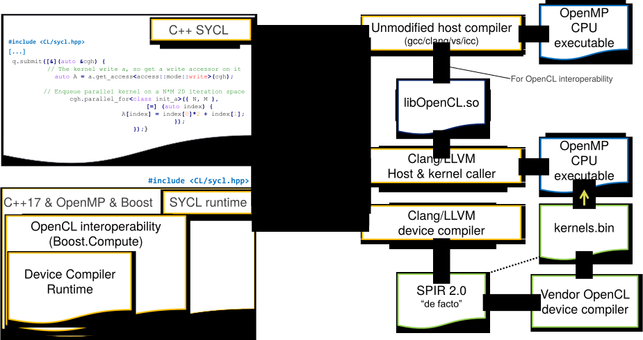
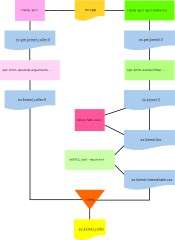

===============================================
 Architecture of triSYCL runtime and compiler
===============================================

.. section-numbering::

.. contents::

.. highlight:: Bash

triSYCL is a pure C++17 header runtime library to provide SYCL_ support
on CPU and accelerators.

To target devices, a device compiler based on Clang_/LLVM_ is required
to extract the kernel from the SYCL_ program, compile it to the kernel
and generate on the host side some glue to call the kernel.

The main library is defined in `<../include/CL/sycl.hpp>`_ which
introduces the API inside the ``::cl::sycl`` namespace as defined by
the SYCL_ 1.2.1 standard.

As a convenience extension, there are 2 other include files that can
be used instead:

- `<../include/SYCL/sycl.hpp>`_ to have the SYCL_ API defined inside
  ``::sycl`` as a shortcut to save 4 letters. It does not define
  anything inside the ``::cl::sycl`` namespace, allowing another
  ``SYCL_`` implementation to coexist there;

- `<../include/triSYCL/sycl.hpp>`_ which is where the triSYCL
  implementation resides. It defines all the API under ``::trisycl``,
  leaving the ``::cl`` and ``::sycl`` namespaces free to be used by
  some other implementations and to have triSYCL to coexist with them
  and even to use them.

Coding rules
============

All the headers are mainly called in alphabetic order in
`<../include/triSYCL/sycl.hpp>`_.

More generally all the header files are included in alphabetic order,
but with the standard headers first, then ``Boost`` libraries and at
last the triSYCL headers.

The coding style is similar to the ``STL`` or ``Boost`` libraries,
with lines with less than 80 characters, to fit on a standard punch
card. :-)

Tab characters are not used. Be sure you configure your editor to help
you and to prevent parasitic spacing, such as trailing white spaces
and so on.

To avoid ODR conflicts with a pure header library, C++17 ``inline`` is
used massively.

Basic organization
------------------

Each SYCL_ concept (for example a ``trisycl::queue`` or according to
the header included, a ``trisycl::queue`` or a ``cl::sycl::queue``) is
defined in its own header file (for example
`<../include/triSYCL/queue.hpp>`_) so it is easy to find the
definition of a concept.

If a concept requires more implementation details, these are detailed
inside a related ``detail`` directory, for example for the ``queue``,
besides the file `<../include/triSYCL/sycl/queue.hpp>`_, there might be also
inside `<../include/triSYCL/queue/detail>`_ the files

- `<../include/triSYCL/queue/detail/queue.hpp>`_ defines an
  implementation detail common to the concept of ``queue`` with a
  virtual interface;

- `<../include/triSYCL/queue/detail/host_queue.hpp>`_ inherits from
  the ``detail::queue`` above to implement the host device on CPU;

- `<../include/triSYCL/queue/detail/opencl_queue.hpp>`_ inherits from
  the ``detail::queue`` above to implement an OpenCL_ device.

In `<../include/triSYCL/detail>`_ there are also some code used by the
implementation but not directly related to some SYCL_ classes.

Source-code documentation
-------------------------

The documentation of the source-code itself is based on Doxygen.

Doxygen modules are used to group the code elements according to
various themes.

To build the Doxygen documentation, in the top directory, run

.. code:: bash

  make

that will produce ``tmp/Doxygen/SYCL`` with the API documentation and
``tmp/Doxygen/triSYCL`` with the documented triSYCL implementation
source code.

To publish the documentation on GitHub:

.. code:: bash

  make publish

and finish as explained by the ``make`` output.

Implementation details of documentation workflow
~~~~~~~~~~~~~~~~~~~~~~~~~~~~~~~~~~~~~~~~~~~~~~~~

The documentation workflow is basically implemented with
`<../Makefile>`_ and `<../dev/publish_Doxygen>`_.

This script builds the content of
https://github.com/triSYCL/triSYCL/tree/gh-pages branch which is used
by GitHub to be published as https://triSYCL.github.io/triSYCL

The connection between this ``gh-pages`` branch and
https://triSYCL.github.io/triSYCL is done with
https://github.com/triSYCL/triSYCL/settings in the "GitHub Pages" section.

`<../dev/publish_Doxygen>`_ is a little bit convoluted because it
connects the history of the documentation to the history of the
project itself, for traceability. So if you look at the main branches
of the project there is no compiled files for the documentation while
at the same time in the ``gh-pages`` branch you have only the compiled
documentation and not the source directories. But the history is still
connected to the main branch, to track exactly where the documentation
comes from.

triSYCL architecture for CPU
============================

The implementation for CPU is a pure C++17 templated header library
and does not require a specific `C++`_ or SYCL_ compiler.

The dataflow SYCL_ infrastructure between kernels related by
buffer/accessors dependencies is implemented in
`<../include/triSYCL/command_group/detail/task.hpp>`_ with plain `C++`_
``std::thread`` and ``std::condition_variable``. It should be updated
to a more efficient library in the future for the tasking, such as
Boost.Fiber or TBB;

All the kernel code itself is accelerated with OpenMP or with TBB
according to some macros parameters, allowing various behaviors. See
`<../include/triSYCL/parallelism/detail/parallelism.hpp>`_ or
`<../include/triSYCL/parallelism/detail/parallelism_tbb.hpp>`_ for the
implementation details.

Since in SYCL_ barriers are available and the CPU triSYCL
implementation does not use a compiler to restructure the kernel code,
it is implemented in SYCL_ with CPU threads provided by OpenMP. This
is massively inefficient. If you know that there will be no barrier
you should define the ``TRISYCL_NO_BARRIER`` macro first.

Anyway, low-level OpenCL_-style barriers should not be used in modern
SYCL_ code. Hierarchical parallelism, which is performance portable
between device and CPU, is preferable.

Otherwise, using an OpenCL_ target on CPU can be used to rely on the
CPU OpenCL_ stack to do CPU-friendly SIMD-ization of the
barrier-spaghetti code. But this relies on the triSYCL device
compiler...

triSYCL architecture for accelerator
====================================

When targeting an accelerator, even if SYCL_ is a pure `C++`_ DSEL_, a
specific compiler is required to extract the kernel code and compile
it to some target device and at the same time to compile on the host side
some glue code around the extraction boundary to transfer data to and
from the device and call the kernel itself.

The device compiler is very experimental and exists in several versions,
mainly dependent on different Clang_/LLVM_ versions.

The specific versions are in branches with name starting with
``sycl/``.  For example:

- our latest version with the latest Clang_/LLVM_ supporting triSYCL
  will be in:

  https://github.com/triSYCL/clang/tree/sycl/master

  https://github.com/triSYCL/llvm/tree/sycl/master

- with Clang_/LLVM_ 7 supporting triSYCL:

  https://github.com/triSYCL/clang/tree/sycl/release_70/master

  https://github.com/triSYCL/llvm/tree/sycl/release_70/master

Installation & compilation
--------------------------

First download or clone the device compiler repositories, for example
with::

  git clone --branch sycl/master git@github.com:triSYCL/llvm.git
  cd llvm/tools
  git clone --branch sycl/master git@github.com:triSYCL/clang.git
  cd ../..

Then compile for example with::

  mkdir build
  cd build
  cmake -DCMAKE_EXPORT_COMPILE_COMMANDS=1 \
    -DLLVM_ENABLE_CXX1Y=On \
    -DCMAKE_BUILD_TYPE=Release \
    -DLLVM_TARGETS_TO_BUILD="X86" \
    -DLLVM_BUILD_LLVM_DYLIB:BOOL=ON \
    -DLLVM_LINK_LLVM_DYLIB:BOOL=ON \
    ../llvm
  # Use -j with 1 thread per core to speed up compilation
  make -j`nproc`

You might replace the ``Release`` by ``Debug`` above if you want to
debug the compiler itself. Look at https://llvm.org/docs/CMake.html
for more information.

Compilation and installation of the triSYCL runtime::

  git clone --branch device git@github.com:triSYCL/triSYCL.git
  # Compile the triSYCL_tool command
  cd triSYCL/src
  make

Usage
-----

Unfortunately there is no Clang_ driver yet to generate directly the host and
device part and it is up to the end-user for now, since it is still
experimental and in development. So, using the compiler
is... painful. :-(

It is expected to be used as for example with examples from
`<../tests/device_compiler>`_. Everything is done from
`<../tests/Makefile>`_ when making a target ending with the
``.kernel_caller`` extension such as
``tests/device_compiler/single_task_vector_add_drt.kernel_caller``.

triSYCL assumes some recent Clang_/LLVM_ installed, independently from
the one used by device compiler which might not be new enough.

A recent version of Boost is required. It is available with package
``libboost-all-dev`` on Debian/Ubuntu or with some more modern
specific versions such as ``libboost1.67-all-dev``.

The following assumes that you have an `OpenCL ICD
<https://www.khronos.org/news/permalink/opencl-installable-client-driver-icd-loader>`_
installed on the machine, to allow several OpenCL_ platforms usable at
the same time on the machine. For example the ``ocl-icd-libopencl1``
package on Debian/Ubuntu.

Using OpenCL PoCL on CPU and other targets
~~~~~~~~~~~~~~~~~~~~~~~~~~~~~~~~~~~~~~~~~~

The device compiler generates the kernels as SPIR-df (*de facto*),
which is SPIR_ 2.0 encoded with LLVM_ IR of a more recent version than
LLVM_ 3.4 expected by the SPIR_ specification. So a very modern SPIR+
consumer is required, such as a recent PoCL_. It is not the version
available in Ubuntu 17.10 for example, so you might compile and
install PoCL_ on your own... The rule is that PoCL_ has to use a
Clang_/LLVM_ at least as modern as the one used by the device compiler
to be able to consume the IR.

Note that you can also use PoCL_ to target CUDA_, as a way to use
SYCL_ on nVidia GPU.

Set up the environment::

  # Used by the tests Makefile to find the device compiler
  export LLVM_BUILD_DIR=<directory_where_LLVM_is_built>

  # Use PoCL OpenCL stack
  export BOOST_COMPUTE_DEFAULT_PLATFORM='Portable Computing Language'
  # Do not use another OpenCL stack if the one requested is not available
  export BOOST_COMPUTE_DEFAULT_ENFORCE=1
  # OPTIONAL: Used by the tests Makefile and tells triSYCL to queue kernels
  # using OpenCL nd_range_kernel when parallel_for is used. Rather than queuing
  # a single work-item task and looping over the range inside of the work-item.
  # This variable is used by the Makefile and requires recompilation if you
  # change its value
  export TRISYCL_USE_OPENCL_ND_RANGE=1

Compile and execute a small example::

  cd tests
  make -j2 device_compiler/single_task_vector_add_drt.kernel_caller
  device_compiler/single_task_vector_add_drt.kernel_caller
    [...]
    Queue waiting for kernel completion

    **** no errors detected

Using Xilinx SDx xocc for FPGA
~~~~~~~~~~~~~~~~~~~~~~~~~~~~~~

Let's assume you have installed Xilinx_ SDx somewhere, and probably a
``/etc/OpenCL/vendors/xilinx.icd`` file containing the string
``libxilinxopencl.so`` to have the OpenCL_ ICD indirection
working.

Initialize the environment with something like::

  export XILINX_SDX=/opt/Xilinx/SDx/2018.3
  PATH=$PATH:$XILINX_SDX/bin
  export LD_LIBRARY_PATH=$XILINX_SDX/runtime/lib/x86_64:$XILINX_SDX/lib/lnx64.o

  # Used by the tests Makefile to find the device compiler
  export LLVM_BUILD_DIR=<directory_where_LLVM_is_built>

  # Use the Xilinx OpenCL stack
  export BOOST_COMPUTE_DEFAULT_PLATFORM=Xilinx
  # Do not use another OpenCL stack if the one requested is not available
  export BOOST_COMPUTE_DEFAULT_ENFORCE=1

Compile and execute a small example::

  cd tests
  make -j2 device_compiler/single_task_vector_add_drt.kernel_caller
  device_compiler/single_task_vector_add_drt.kernel_caller
    [...]
    Queue waiting for kernel completion

    **** no errors detected

Note that since the final code contains the FPGA bit-stream
configuration file and not the SPIR_ representation, it takes *quite a
lot of time* to be generated through SDx...

High-level workflow
-------------------

   Figure 1: High-level view of the compilation workflow in triSYCL.

When compiling on CPU, since triSYCL relies on the fact that SYCL_ is a
pure `C++`_ executable DSEL_, the `C++`_ SYCL_ code is just compiled with any
host compiler (top of `Figure 1`_) which includes the SYCL_ runtime
(bottom left of `Figure 1`_) which is a plain `C++`_ header file. A CPU
executable is generated, using OpenMP_ for multithreading.

If some OpenCL_ features are used through the interoperability mode
(non-single-source SYCL_), then an OpenCL_ library is required to
interact with some OpenCL_ devices.

When using SYCL_ in single-source mode on device, the compilation flow
is quite more complex because it requires a device compiler to split
and compile the code for the final target.

The Clang_/LLVM_-based device compiler (bottom of `Figure 1`_)
compiles the `C++`_ SYCL_ code as for CPU only, but just keep the
kernel part of the code and produce a simple portable intermediate
representation (SPIR_) of the kernels.  For now, triSYCL uses SPIR-df
(*de facto*), a non-conforming SPIR 2.0 encoded in something newer
than LLVM_ 3.4 IR. But you could graft an official SPIR_ down-caster if
you have one or a `SPIR-V`_ generator using this SPIR-df.

Then this SPIR-df output is optionally compiled by some vendor
compiler to speed-up the launch time by doing some compilation
ahead. With PoCL_ it is not done (dashed arrow line) but for FPGA it is
done ahead-of-time since compilation is *very* slow.

In single-source mode on the host side, the source code has also to go
through the device compiler, but to do the dual operation: to remove the
kernel code and just to keep the host code. This is also where some glue to
call the kernels and to do the argument serialization is done.

The kernel binary generated by the other compiler flow is also
included in the host code so that the main host executable is
self-contained and can start the kernel on the device without having
to load the binary from an external file. It is a manual way to get a
*fat binary* and we could probably use the official off-loading
Clang_/LLVM_-way in the future.

Low-level view of the device compiler workflow
----------------------------------------------

   Figure 2: Low-level view of the compilation workflow in triSYCL.

The real workflow is currently implemented in `<../tests/Makefile>`_
and this is the current source of truth. The path to go for example
from a ``ex.cpp`` file to a final ``ex.kernel_caller`` is summarized
on `Figure 2`_,

Each intermediate file is characterized by a specific extension:

``.cpp``
  for the single-source SYCL_ `C++`_ input file;

``.bc``
  some LLVM_ IR bitcode;

``.ll``
  some LLVM_ IR in textual assembly syntax;

``.kernel_caller``
  for the final host executable, with the kernel binary internalized
  so the host can load and launch the kernels on the devices without
  external files.

Note that the file without any extension is actually the normal
CPU-only executable, which does not appear in this picture because it
is about compiling for device instead.

All the SYCL_-specific LLVM_ passes are in the ``lib/SYCL`` directory of LLVM_.

Host-side compilation flow
~~~~~~~~~~~~~~~~~~~~~~~~~~

The file extensions used on the host side are:

``.pre_kernel_caller.ll``
  the SYCL_ `C++`_ code compiled by Clang_ for the host side, including
  the call of the kernels;

``.kernel_caller.ll``
  the LLVM_ IR of the host code after the LLVM_ triSYCL
  transformation passes;

To generate the ``.pre_kernel_caller.ll`` file, the source code is
compiled with::

  clang -O3 -sycl

which is basically ``clang`` unchanged, but with ``loop-idiom``
detection pass skipped because otherwise it generates some memory copy
intrinsic functions that prevents some argument flattening to work
later.

The ``-O3`` is important to generate optimized minimal code that can
be massaged later, with a lot of in-lining to have the `C++`_ constructs
to disappear. Otherwise less optimized code breaks a lot of
assumptions in the triSYCL-specific LLVM_ passes later.

The compilation flow to generate the final ``.kernel_caller.ll`` file
is based on LLVM_ ``opt`` to apply a sequence of LLVM_ passes:

``-globalopt -deadargelim``
  to clean-up the code before SYCL_ massaging;

``-SYCL-args-flattening``
  is a fundamental SYCL_-specific pass that takes the lambda capture
  (basically a `C++`_ structure passed by address) of a SYCL_ kernel
  lambda expression and flattens it as its content. So basically if the
  capture has several scalar and accessor parameters, the structure
  address used in the function call is replaced by a function call
  with all the parameters explicitly passed as arguments. This makes
  the classical OpenCL_-style kernel parameter to show up;

``-loop-idiom``
  then the loop-idiom detection pass which was not applied before to
  avoid choking the ``SYCL-args-flattening`` pass can now be applied
  to optimize some loops and generate the LLVM_ intrinsics representing
  memory copies and initialization for example;

``-deadargelim``
  removes some dead code that might be left by previous passes;

``-SYCL-serialize-arguments``
  is another fundamental SYCL-specific pass on host side which
  replaces a kernel function call by some calls to the runtime to
  select the kernel and serialize all the kernel arguments.

  The input code from the triSYCL headers of the form

  .. code-block:: C++

     cl::sycl::detail::set_kernel_task_marker(t);
     cl::sycl::detail::instantiate_kernel<KernelName>(/* flatten args */);

  is replaced by

  .. code-block:: C++

     cl::sycl::drt::set_kernel(detail::task &task, const char *kernel_name,
                               const char *kernel_short_name);
     // For each parameter call:
     // either for a scalar argument
     cl::sycl::drt::serialize_arg(detail::task &task, std::size_t index,
                                  void *arg, std::size_t arg_size);
     // or for an accessor argument
     cl::sycl::drt::serialize_accessor_arg(detail::task &task, std::size_t index,
                                           void *arg, std::size_t arg_size);

  The marking functions generated by triSYCL headers are in
  `<../include/triSYCL/detail/instantiate_kernel.hpp>`_ while the
  functions used by the transformed code are in
  `<../include/triSYCL/device_runtime.hpp>`_. The functions from
  ``cl::sycl::drt::`` are the link to the underlying runtime, such as
  OpenCL_.

``-deadargelim``
  again to removes some dead code that might be left by previous pass.

Device-side compilation flow
~~~~~~~~~~~~~~~~~~~~~~~~~~~~

The file extensions used on the kernel side are:

``.pre_kernel.ll``
  the SYCL_ `C++`_ code compiled by Clang_ for the host side, including
  the call of the kernels;

``.kernel.bc``
  the LLVM_ IR of the host code after the LLVM_ triSYCL pass
  transformations;

``.kernel.bin``
  is for the kernel binary to be shipped into the final host
  executable. This is typically a SPIR_ LLVM_ IR bitcode or an FPGA
  bitstream configuration;

``.kernel.internalized.cxx``
  is the kernel binary represented as `C++`_ code so it can just be
  compiled by a C++ compiler to have it internalized into the final
  host binary and used by the runtime.

  It is constructed from the ``.kernel.bin`` file through the helper
  ``triSYCL_tool --source-in``.

To generate the ``.pre_kernel.ll`` file, the source code is compiled
with::

  clang -O3 -DTRISYCL_DEVICE -sycl -sycl-is-device

This is similar to the compilation for the host side and the ``-O3``
is important for the same reasons. ``-DTRISYCL_DEVICE`` is used so
the triSYCL headers behave slightly differently on the device code,
mainly enabling some address-space related code used to represent
OpenCL_ ``global`` or ``local`` memory for example.

Like for the host side path, the compilation flow to generate the
final ``.kernel.bc`` file is based on LLVM_ ``opt`` to apply a sequence
of LLVM_ passes with:

``-globalopt -deadargelim -SYCL-args-flattening -deadargelim``
  are applied as for the host side. It is important to have globally
  the same code compiled with the same passes for both host and device
  side to keep the code synchronized before serialization. Otherwise
  it would lead to some mismatch and some wrong global code at the
  end;

``-SYCL-kernel-filter``
  this is one of the most important SYCL_-specific pass on the device
  side, to extract the kernels from the single-source code. Actually
  it works in 2 passes, in a mark-and-sweep approach. Here is the
  first pass that marks all the kernel with external linkage (tricking
  the compiler as it might be useful from outside) and all the
  non-kernel part with internal linkage;

``-globaldce``
  this is the second stage of kernel selection. It will remove all the
  dead code of the program. Since only the kernels have been marked as
  potentially used from the outside, after application of this pass,
  only what is transitively useful for the kernels are left. So only
  remains the device code;

``-RELGCD``
  compiling C++ comes with an ABI storing the lists of global static
  constructors and destructors. Unfortunately even if at the end these
  lists are empty because of SYCL_ specification, they are not removed
  by ``-globaldce`` and it is not supported by SPIR_ yet. So this
  SYCL_-specific pass Removes the Empty List of Global Constructors or
  Destructors (RELGCD);

``-reqd-workgroup-size-1``
  in the case the kernel are compiled with only 1 SPIR_ work-group with
  1 work-item (common use case on FPGA), this SYCL_-specific pass add a
  SPIR_ metadata on the kernels to specify it will be called with *only*
  1 work-item. This way the target compiler can spare some resources
  on the device;

``-inSPIRation``
  is the SYCL_-specific pass generating the SPIR_ 2.0-style LLVM_ IR
  output. Since it generates LLVM_ IR with the version of the recent
  LLVM_ used, it is quite more modern that the official SPIR_ 2.0 based
  on LLVM_ 3.4 IR. So it is a SPIR-df (*de facto*)", which is nevertheless
  accepted by some tools. But by using a bitcode down-caster, it could
  probably make some decent official SPIR 2.0 encoded in LLVM_ 3.4
  IR. Otherwise a `SPIR-V`_ back-end could generate some `SPIR-V`_ code from
  this.

``-globaldce`` is the last cleaning to remove unused functions, for
  example ``__gxx_personality_v0`` that was used to specify the
  exception handling flavour for the kernel functions before SPIR_
  transformation.

Testing infrastructure
======================

Look at `<testing.rst>`_ and `<../tests/README.rst>`_

Continuous integration
======================

Travis CI is used to validate triSYCL with its test suite from `tests/
<../tests>`_ on CPU and OpenCL_ with interoperability mode, using CMake
``ctest``.

The device compiler is not tested yet through Travis CI. :-(

Look at `<../.travis.yml>`_ and `<../Dockerfile>`_ for the
configuration.

..
  Actually include:: doc/common-includes.rst does not work in GitHub
  :-( https://github.com/github/markup/issues/172

  So manual inline of the following everywhere... :-(

.. Some useful link definitions:

.. _AMD: http://www.amd.com

.. _Bolt: https://github.com/HSA-Libraries/Bolt

.. _Boost.Compute: https://github.com/boostorg/compute

.. _Boost.MultiArray: http://www.boost.org/doc/libs/1_55_0/libs/multi_array/doc/index.html

.. _C++: http://www.open-std.org/jtc1/sc22/wg21/

.. _committee: https://isocpp.org/std/the-committee

.. _C++AMP: http://msdn.microsoft.com/en-us/library/hh265137.aspx

.. _Clang: http://clang.llvm.org/

.. _CLHPP: https://github.com/KhronosGroup/OpenCL-CLHPP

.. _Codeplay: http://www.codeplay.com

.. _ComputeCpp: https://www.codeplay.com/products/computesuite/computecpp

.. _CUDA: https://developer.nvidia.com/cuda-zone

.. _DirectX: http://en.wikipedia.org/wiki/DirectX

.. _DSEL: http://en.wikipedia.org/wiki/Domain-specific_language

.. _Eigen: http://eigen.tuxfamily.org

.. _Fortran: http://en.wikipedia.org/wiki/Fortran

.. _GCC: http://gcc.gnu.org/

.. _GOOPAX: http://www.goopax.com/

.. _HCC: https://github.com/RadeonOpenCompute/hcc

.. _HIP: https://github.com/ROCm-Developer-Tools/HIP

.. _hipSYCL: https://github.com/illuhad/hipSYCL

.. _HSA: http://www.hsafoundation.com/

.. _Khronos: https://www.khronos.org/

.. _LLVM: http://llvm.org/

.. _Metal: https://developer.apple.com/library/ios/documentation/Metal/Reference/MetalShadingLanguageGuide

.. _MPI: http://en.wikipedia.org/wiki/Message_Passing_Interface

.. _OpenACC: http://www.openacc-standard.org/

.. _OpenCL: http://www.khronos.org/opencl/

.. _OpenGL: https://www.khronos.org/opengl/

.. _OpenHMPP: http://en.wikipedia.org/wiki/OpenHMPP

.. _OpenMP: http://openmp.org/

.. _PACXX: http://pacxx.github.io/page/

.. _PoCL: http://portablecl.org/

.. _SYCL Parallel STL: https://github.com/KhronosGroup/SyclParallelSTL

.. _RenderScript: http://en.wikipedia.org/wiki/Renderscript

.. _SC16: http://sc16.supercomputing.org

.. _SG14: https://groups.google.com/a/isocpp.org/forum/?fromgroups=#!forum/sg14

.. _SPIR: http://www.khronos.org/spir

.. _SPIR-V: http://www.khronos.org/spir

.. _SYCL: https://www.khronos.org/sycl

.. _TensorFlow: https://www.tensorflow.org

.. _TBB: https://www.threadingbuildingblocks.org/

.. _Thrust: http://thrust.github.io/

.. _triSYCL: https://github.com/triSYCL/triSYCL

.. _VexCL: http://ddemidov.github.io/vexcl/

.. _ViennaCL: http://viennacl.sourceforge.net/

.. _Vulkan: https://www.khronos.org/vulkan/

.. _Xilinx: http://www.xilinx.com

..
    # Some Emacs stuff:
    ### Local Variables:
    ### mode: rst
    ### minor-mode: flyspell
    ### ispell-local-dictionary: "american"
    ### End:
